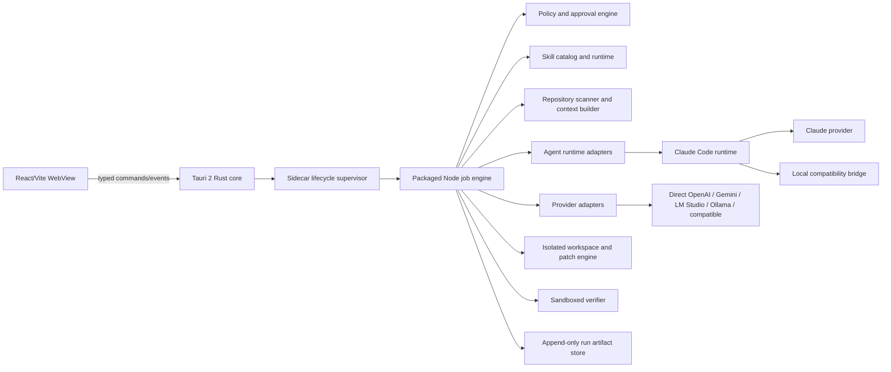

# Pimp Code App — Product and Implementation Plan

Status: Phase 1 plan-only slice implemented; live-provider and second-machine gates remain, updated 12 August 2026

## Recommended product direction

Build a local-first desktop application for improving frontend repositories through reusable `SKILL.md` workflows and interchangeable cloud or local LLMs.

The desktop UI should be a client of a separate TypeScript job engine. The engine—not the selected model—owns repository access, capability checks, command execution, patch application, approvals, and audit artifacts. Models may inspect approved context and propose typed actions; they never receive an unrestricted shell.

The default workflow is:

```text
select repository → select skill → choose provider/model → preview scope and egress
→ create read-only plan → approve capabilities/tasks → build patch in isolation
→ review diff → run approved checks → publish/apply result
```

Recommended MVP boundaries:

- Local desktop app, Windows-first, with a path to macOS/Linux.
- Frontend TypeScript/JavaScript repositories first.
- Bring-your-own provider credentials; no hosted Pimp Code backend.
- One skill per run initially; resumable runs and skill composition later.
- Read-only planning by default. Writes, commands, network, installs, and deletion are separate approvals.
- OpenAI, Claude, Gemini, LM Studio, and Ollama are first-class adapters. A generic OpenAI-compatible profile is best-effort, not a promise of full parity.
- No automatic commit, push, pull request, or provider fallback in the MVP.
- No open third-party skill marketplace until signing, review, and sandbox policies exist.

## What the product is actually selling

“Pimp my code” is too vague to be an executable goal. The product should sell a controlled improvement workflow with evidence:

- detect whether a skill applies to the selected repository;
- explain the intended outcome and affected scope;
- produce a repository-specific plan;
- generate a reviewable patch when implementation is authorized;
- prove the result with relevant checks and runtime evidence;
- preserve a complete record of inputs, approvals, changes, and failures.

The app should not promise identical output across providers. It should promise the same safety protocol, artifacts, approvals, and acceptance checks. Quality remains model- and skill-dependent.

Do not lead with a single “code quality score.” The sibling TypeScript prototype has useful evidence-based scoring, but an improving score is not proof that a migration works. Build/test/runtime evidence and scoped diffs should be primary; scores can remain an optional summary.

## Repository findings that shape the plan

The project started as a greenfield UI and integration repository. It now contains a working Tauri 2 feasibility spike with a React renderer, a Rust-owned child-process boundary, a TypeScript agent host, a Claude runtime path, and a loopback-only OpenAI-compatible bridge. The two sibling prototypes remain useful references, but neither is the finished engine for this product.

| Existing asset                 | Reuse                                                                                                                        | Do not inherit unchanged                                                                                                                                |
| ------------------------------ | ---------------------------------------------------------------------------------------------------------------------------- | ------------------------------------------------------------------------------------------------------------------------------------------------------- |
| `../pimp-my-codebase-agent-ts` | TypeScript domain types, scanner concepts, deterministic findings, scoring, planning, reporting, run artifacts, check guards | LM Studio-only provider type, target-controlled privacy policy, current skill parser, target-local run storage, proof-of-concept README-only apply mode |
| `../pimp-my-codebase-agent`    | Explicit scope, clean-worktree checks, guarded lifecycle, baseline/final checks, diff review, audit concepts                 | Python implementation as the new core, narrow mutation logic, current provider coverage                                                                 |
| `../skills`                    | Eleven valuable frontend workflows and their complete instructions                                                           | Assuming the Markdown itself grants safe executable capabilities                                                                                        |

Important incompatibilities and risks:

- The TypeScript loader searches only `.pimp-my-codebase/skills/<name>.md` and parses a bespoke heading schema. It cannot discover or interpret the recursive `../skills/**/SKILL.md` packages.
- The current TypeScript “apply” path only creates a missing `README.md`; it does not execute migration skills.
- The skill repository contains 11 skills, but seven directories are currently untracked and the repository has only one commit. Reproducible versioning is unresolved.
- The Zustand skill includes a Python validator. It accepts an arbitrary checklist path and must never be auto-executed merely because the skill references it.
- Target configuration can currently weaken ignore rules, and “read secrets: false” is not a hard scanner invariant. The new engine must enforce a non-overridable denylist.
- Verification commands are process-spawned without a shell, but a permitted executable can still run arbitrary target code. `npm test` is code execution, not a harmless read.
- Selecting a nested directory can currently cause the scanner to walk upward to an ancestor project. The new app must display and require confirmation of the exact canonical root.
- Planning currently writes run artifacts inside the target repository. In the new app, review mode should keep artifacts in app-owned storage unless the user explicitly exports them.

Before extracting code from the TypeScript prototype, stabilize its dirty worktree and run its existing tests. Reuse modules selectively behind new interfaces instead of copying the whole CLI into the desktop process.

## Primary users and jobs

Initial user: a solo frontend developer or small frontend team working on a local repository.

Core jobs:

1. Diagnose a broken or outdated frontend project.
2. Review UX, accessibility, maintainability, architecture, or tooling.
3. Plan a migration with repository-specific evidence.
4. Apply a bounded modernization safely.
5. Compare provider/model results without changing the safety workflow.
6. Resume a long checklist-driven migration without losing evidence.

Non-goals for the first release:

- general-purpose chat or IDE replacement;
- backend and arbitrary-language transformation;
- unattended CI automation;
- cloud repository hosting;
- public skill marketplace;
- automatic Git publishing;
- guaranteed support for every model exposed by a provider.

## Critical user journey

### 1. Connect

The user creates a provider profile, stores its secret in the OS credential vault, tests the connection, and selects a model. Local endpoints show server reachability, installed/loaded models, and actual capabilities where discoverable.

### 2. Scope

The user selects a folder. The app resolves its real path, detects Git and monorepo boundaries, then asks the user to confirm either the repository root or a specific workspace. It shows dirty files without reading Git history by default.

### 3. Choose a workflow

The skill catalog is loaded recursively from explicitly configured roots such as `../skills`. The UI shows name, description, source, package digest/version, lifecycle state (`discovered`, `schema-valid`, `trusted`, `certified`, `stale`, or `revoked`), supported modes, required capabilities, and applicability evidence. These states are independent: valid does not mean trusted, and trusted does not mean proven effective.

### 4. Preview

Before a remote request, show:

- selected provider and model;
- files/snippets and approximate token count leaving the machine;
- redacted and excluded paths;
- skill hash and full requested capabilities;
- expected commands/network access;
- token/cost limits when the provider exposes usage information.

### 5. Plan

The engine scans approved files, gathers deterministic evidence, sends bounded context to the model, validates structured output, and creates a plan in app-owned storage. Review mode performs no target writes, project commands, browser launch, or package install. Network is limited to the approved provider call and, when separately approved, an engine-owned official-document broker; without current documentation, version-sensitive conclusions are labelled provisional.

### 6. Approve and execute

The user selects plan tasks and capabilities. In the MVP, Apply is limited to a confirmed clean Git repository and prepares edits in an isolated worktree. Dirty and non-Git repositories remain planning-only until a safe copy/composition policy is implemented. The engine shows incremental activity and pauses at any new capability request.

### 7. Review and verify

The UI presents file-by-file diffs, package/lockfile changes, deletions, command output, and acceptance criteria. Checks run only after explicit approval and in a sandbox with a scrubbed environment and network off by default.

### 8. Publish or recover

The user applies an approved patch to the original worktree, exports it, or discards it. A hash check prevents applying onto files that changed since the run began. Runs can be cancelled, resumed from durable engine stages, or cloned with another provider/model. An interrupted ordinary model turn restarts; only an explicitly durable provider job may reconnect provider-side.

## Application architecture

Tauri 2 is the selected MVP shell. The Rust core owns the trusted desktop boundary, narrow typed commands, native dialogs, resource resolution, and child-process supervision. The Node/TypeScript job engine remains a separate packaged sidecar behind a versioned JSONL protocol so the renderer never receives filesystem, process, Git, environment, or credential access. This boundary also keeps a future CLI or alternate desktop shell possible.



Renderer security invariants:

- no Node runtime, raw Tauri internals, filesystem API, or process API exposed to the renderer;
- local packaged content only, restrictive CSP, no raw remote HTML, and no navigation to untrusted origins;
- allowlisted Tauri commands/events with the smallest capability set per window;
- release sidecars resolved from integrity-checked packaged resources, never ambient `PATH` or workspace paths;
- validate every command argument and re-resolve every path in the Rust core and engine;
- render model/skill Markdown as untrusted, sanitized content;
- API keys never enter retained renderer application state: the one-shot credential field is uncontrolled, is cleared before the trusted IPC promise is awaited, and receives only presence/source status back. Filesystem APIs, process handles, and raw environment variables never enter renderer state.

The Tauri capability manifest, CSP, command surface, updater configuration, and bundled sidecars are release-gated security configuration. Tauri reduces the renderer's ambient authority but does not make the engine, provider traffic, or child processes a sandbox.

### Suggested monorepo shape

```text
pimp-code-app/
  apps/
    desktop/              Tauri Rust core, capabilities, packaging, React/Vite UI
  packages/
    protocol/             Versioned commands, events, schemas
    engine/               Job state machine and orchestration
    repository/           Root resolution, scan, context, Git state
    skill-runtime/        Discovery, validation, policy overlays
    provider-core/        Provider/model contracts and capability gates
    provider-openai/
    provider-anthropic/
    provider-google/
    provider-lmstudio/
    provider-ollama/
    provider-compatible/
    docs-broker/          Allowlisted official-document retrieval and cache
    patch-engine/         Isolated workspace, diffs, conflict checks
    verifier/             Structured command policy and sandbox adapter
    artifact-store/       Run manifests, events, reports, patches
    test-fixtures/        Representative frontend repositories
```

Use an npm workspace and strict TypeScript. Keep domain schemas in `protocol` and validate all renderer/Rust/engine/provider boundaries at runtime. Use append-only JSONL events plus immutable JSON/Markdown/diff artifacts for the MVP, backed by atomic checkpoints, operation IDs, and idempotency records; add SQLite only when history querying genuinely requires it.

## Job engine and durable run protocol

Every run is a state machine, not a long renderer request.

```text
created → preflight → context_ready → planning → awaiting_plan_approval
→ preparing_workspace → editing → awaiting_diff_approval
→ verifying → awaiting_publish_approval → completed
```

`cancelled`, `failed`, `blocked`, `interrupted`, and `unknown_outcome` are terminal or resumable states with a recorded reason. Writes and commands use operation IDs and exactly-once state transitions. If a crash leaves a side effect uncertain, the engine records `unknown_outcome` and requires reconciliation instead of retrying it. A run holds a lock for its canonical target root so two jobs cannot mutate the same files concurrently.

Minimum run manifest:

- run ID, timestamps, engine/protocol version;
- canonical repository/workspace path and starting file hashes;
- Git status summary without secret content;
- skill source, name, full content hash, policy version, and snapshotted files;
- provider profile ID, provider/model identifiers, and capability snapshot;
- approved context manifest and redaction summary;
- prompts/request hashes, normalized provider events, usage and cost when available;
- every capability request and approval/denial;
- proposed and approved plan items;
- tool requests/results, patch sets, deletions, and dependency changes;
- verification commands, bounded/redacted output, exit status, and duration;
- publish/apply result and rollback information.

Do not persist API keys, full environment variables, hidden reasoning traces, or unredacted secret matches.

## Skill runtime contract

OpenAI's current [Agent Skills documentation](https://developers.openai.com/api/docs/guides/tools-skills) describes a skill as a versioned file bundle with a `SKILL.md` manifest and explicitly warns that skills introduce prompt-injection, exfiltration, and destructive-action risks. That is the right interchange format. The MVP will not use OpenAI-hosted skill execution: every provider receives the same validated local snapshot through the engine-owned workflow. Hosted execution may be revisited later only as a distinct, separately certified runtime with its own egress and permission model.

### Discovery and validation

- Scan only explicit skill roots; recursively find `SKILL.md` case-insensitively.
- Skip VCS, hidden, generated, and symlinked paths.
- Resolve every package file with `realpath` and reject path escapes.
- Enforce package file-count, byte, and depth limits; accept only validated regular files and reject device/special files.
- Require exactly one case-insensitive `SKILL.md` per package. Parse UTF-8 YAML with alias/depth limits and require a case-folded unique valid `name` plus non-empty `description`.
- Preserve the complete instructions and relative files; `agents/openai.yaml` is optional presentation metadata, not a provider binding.
- Build a full package digest from canonical relative paths and bytes, then snapshot validated files into the run artifact store. Use the immutable snapshot after discovery, never live files.
- Surface malformed packages, duplicate names, and orphan metadata instead of silently guessing. The rescue skill is recursively valid, but its `agents/openai.yaml` currently sits one directory above its `SKILL.md` package root and is orphaned.

### Policy overlay

The standard frontmatter does not declare executable capabilities. Maintain an app-owned, versioned policy overlay for certified skills:

```ts
interface SkillPolicy {
  name: string;
  packageDigest: string;
  modes: Array<"review" | "plan" | "apply">;
  requiredCapabilities: Capability[];
  optionalCapabilities: Capability[];
  expectedArtifacts: ArtifactRule[];
  maximumPathPatterns: string[];
  applicabilityRules: ApplicabilityRule[];
  verificationProfiles: string[];
  risk: "low" | "medium" | "high";
}
```

Unknown or changed skills start as untrusted and planning-only. Certification binds the full package digest, engine/policy version, platform/runtime, mode, fixture class, expiry for time-sensitive guidance, and explicitly evaluated model versions. Applicability rules check facts such as framework/source version, React versus React Native, project language, workspace owner, package manager, relevant code signals, and required checks. For example, the three React upgrades must be sequential and refuse a mismatched source version.

`maximumPathPatterns` is only a certified ceiling. Exact per-run paths come from the approved plan and are intersected with engine policy, the selected workspace, the skill ceiling, and the user's scoped grant. A skill's prose can narrow permissions, but it can never widen the user's or engine's policy.

Enforce precedence outside the model: hard engine policy → explicit user approvals → certified skill policy → skill prose → repository instructions/content. Repository files such as `AGENTS.md`, comments, issue text, and README content may inform a task but can never grant capabilities.

### Capability ledger

Grant capabilities independently and narrowly. A grant records an approval ID, exact operation, canonical repository/workspace and path scope, command/script digest and arguments where applicable, network destination class, context-manifest hash plus provider/model for egress, resource limits, provenance, and expiry. The effective grant is the intersection of hard engine policy, certified skill ceiling, selected workspace, proposed action, and explicit user approval.

Capability classes:

- read approved project files;
- write/create patch;
- rename/delete files;
- write report/checklist into the target;
- run an approved project command;
- execute a bundled skill script;
- install/change dependencies and lockfiles;
- access package registries or official documentation;
- launch a local dev/preview server;
- use browser/screenshots/accessibility tooling;
- inspect Git status/diff or create an isolated worktree;
- send selected context to a named remote provider.

Scripts are data until their exact hash, arguments, working directory, sandbox, network policy, and requested output have been reviewed and approved. Never infer script permission from a Markdown reference.

The official-document broker accepts only engine-selected domains from a versioned allowlist, revalidates every redirect, blocks private/link-local/metadata addresses, sends no ambient credentials, limits response type/size, caches content with source metadata, and records citations/egress. It never fetches an arbitrary model-supplied URL.

### Initial skill certification order

| Skill group                      | Extra runtime needs                                             | Risk/order                                                                |
| -------------------------------- | --------------------------------------------------------------- | ------------------------------------------------------------------------- |
| `rescue-the-project`             | Process/port diagnostics, commands, report                      | Plan-only readiness slice first; full diagnosis after command containment |
| `migrate-react-class-components` | Code edits, React-aware checks, patch review                    | First bounded apply vertical slice                                        |
| `setup-eslint-typescript`        | Package metadata, installs, config writes, lint baseline        | First dependency/tooling vertical slice                                   |
| React 16→17→18→19                | Current docs, dependency graph, runtime/test validation         | High-risk after patch/verification engine is proven                       |
| `migrate-to-vite`                | Build/deploy/env parity, installs, browser/runtime validation   | High-risk                                                                 |
| `upgrade-react-router-to-v8`     | Route parity, runtime baselines, dependency/source/test changes | Second certified plan-only adapter; apply remains high-risk               |
| `migrate-to-zustand`             | Whole-app state tracing, persistent checklist, Python validator | High-risk; bundled script needs explicit policy                           |
| `migrate-to-typescript-7`        | Current compiler/toolchain compatibility, CI/editor consumers   | High-risk and highly time-sensitive                                       |
| Design review/planning skills    | Running app, screenshots, responsive/accessibility/visual QA    | Add after browser and visual evidence tools exist                         |

“All skills appear in the catalog” and “all skills are certified to execute” must be different product states.

## Provider and model abstraction

Do not build one OpenAI-shaped client and route every endpoint through it. Normalize only what the engine truly needs, and preserve provider-specific semantics behind adapters.

Claude Code is one constrained runtime adapter for the Claude provider, not the universal execution backend. Its bundled tools remain restricted by the engine's approved context and read-only policy. The spike's Anthropic-to-OpenAI compatibility bridge is retained only as an explicitly labelled bridge for early loopback local-model testing; it must not define the common provider contract or be presented as native LM Studio/Ollama support. Direct OpenAI, Gemini, LM Studio, Ollama, and generic OpenAI-compatible adapters are added behind the common contract as separate implementations.

Keep the runtime and provider concepts distinct:

```ts
interface RuntimeAdapter {
  id: string;
  supportedProviders: string[];
  healthCheck(profile: ProviderProfile): Promise<RuntimeHealth>;
  listModels?(profile: ProviderProfile): Promise<ModelDescriptor[]>;
  startPlan(request: PlanRunRequest): Promise<GenerationHandle>;
}
```

The initial `claude-code` runtime supports the Claude profile and the explicitly named local compatibility profile. Direct provider adapters implement the lower-level `ProviderAdapter` contract below and leave repository reads, tool loops, permissions, turn limits, retries, and skill execution to the engine.

```ts
type Support = "supported" | "unsupported" | "unknown";
type CancellationKind =
  | "server"
  | "local-runtime"
  | "transport-only"
  | "unknown";
type FinishOutcome =
  | "stop"
  | "tool_calls"
  | "length"
  | "refusal"
  | "safety"
  | "cancelled"
  | "failed"
  | "unknown";

interface CapabilityEvidence<T> {
  value: T;
  source: "provider-api" | "static-profile" | "probe" | "user-override";
  checkedAt: string;
}

interface ProtocolCapabilities {
  protocol: string;
  streamTransport: "sse" | "ndjson" | "websocket" | "none";
  remoteCancellation: Support;
  serverSideState: Support;
}

interface ProviderCapabilities {
  protocols: ProtocolCapabilities[];
  authSchemes: Array<"bearer" | "api-key-header" | "custom" | "none">;
  modelDiscovery: Support;
  modelManagement: Support;
}

interface ModelCapabilities {
  streaming: CapabilityEvidence<Support>;
  functionTools: CapabilityEvidence<Support>;
  parallelTools: CapabilityEvidence<Support>;
  streamedToolArguments: CapabilityEvidence<Support>;
  strictToolSchema: CapabilityEvidence<Support>;
  structuredOutput: CapabilityEvidence<Support>;
  toolsWithStructuredOutput: CapabilityEvidence<Support>;
  imageInput: CapabilityEvidence<Support>;
  contextWindow?: CapabilityEvidence<number | "unknown">;
  maxOutputTokens?: CapabilityEvidence<number | "unknown">;
}

interface GenerationHandle {
  events: AsyncIterable<ProviderEvent>;
  done: Promise<GenerationResult>;
  abortClient(reason?: string): void;
  cancelRemote(): Promise<"accepted" | "unsupported" | "unknown">;
  cancellationSemantics: CancellationKind;
}

interface ProviderAdapter {
  testConnection(profile: ProviderProfile): Promise<ConnectionResult>;
  resolveCapabilities(input: CapabilityQuery): Promise<CapabilitySnapshot>;
  listModels?(profile: ProviderProfile): Promise<ModelDescriptor[]>;
  start(request: GenerationRequest): Promise<GenerationHandle>;
}
```

Each direct provider adapter performs one model turn. The engine owns the tool loop, permissions, retries, and skill execution; provider SDK auto-tool execution stays disabled. A higher-level runtime adapter such as Claude Code may own an internal bounded tool loop only when the engine supplies an allowlisted tool set, canonical scope, configured turn limit, and normalized audit events. Resolve a capability snapshot for the exact runtime, profile, base URL/deployment, protocol, model ID, and execution mode. Model listing is optional.

Normalized events should include `status`, `text_delta`, `tool_call_delta`, `tool_call`, `usage`, `completed`, and `error`. Every tool event carries the original stable call ID, name, sequence/index, argument fragment, and final locally validated arguments so parallel/interleaved calls remain correlated. A terminal event maps to `FinishOutcome` and retains the raw provider reason; a successful HTTP response is not success when output is refused, truncated, safety-stopped, or invalid.

Preserve request IDs, usage, and provider-specific opaque continuation data alongside normalized events. Continuation state is scoped to the same provider, endpoint, model, and run; it is encrypted/retained only as long as needed and is never copied to a cross-provider clone. OpenAI reasoning items, Claude signed thinking blocks, and Gemini thought signatures must not be flattened and reconstructed as generic chat text.

Provider reasoning/thinking data should not become an assumed cross-provider feature or be persisted by default. Normalize only a documented user-visible reasoning summary when one exists.

Capabilities belong primarily to the selected model, endpoint, and deployment—not just the provider. Combine official metadata, endpoint discovery, user overrides, and a small safe probe. Keep unknown as a real state; never turn it into supported.

### Adapter strategy

| Adapter            | Recommended integration                                                                                               | Important behavior                                                                                                                           |
| ------------------ | --------------------------------------------------------------------------------------------------------------------- | -------------------------------------------------------------------------------------------------------------------------------------------- |
| Claude Code runtime | Official Claude Agent SDK with its packaged Claude Code binary                                                       | Claude-only runtime adapter for the first cloud path; bounded read-only tools, turns, diagnostics, and explicit egress approval               |
| OpenAI             | Official SDK and Responses API                                                                                        | Streaming, strict function schemas, structured final output, usage, and model-specific capabilities; hosted Skills excluded from MVP         |
| Anthropic direct (optional later) | Official SDK and Messages API                                                                            | Not required for the first Claude path; if added, preserve top-level system instructions, content blocks, and native stop reasons             |
| Google Gemini      | Official `@google/genai` SDK; Interactions preferred with `generateContent` fallback                                  | Function calls, structured output, thought signatures, and client-only abort semantics need native handling                                  |
| LM Studio          | Native v1 API for reachability/model management; `/v1/responses` or `/v1/chat/completions` for custom tool generation | Native `/api/v1/chat` does not provide arbitrary custom tools; local model/tool quality still varies                                         |
| Ollama             | Native API/SDK, one client instance per active stream/handle                                                          | Native streaming is NDJSON; `abort()` affects all streams owned by that client, and capabilities vary by model                               |
| Generic compatible | Configurable base URL and headers with capability probes                                                              | Best-effort subset; never assume `/models`, Responses, tools, JSON schema, or cancellation all work                                          |

The temporary Claude Code compatibility bridge to loopback OpenAI Chat Completions endpoints is intentionally absent from the direct-adapter table: it is a migration aid with a narrower compatibility promise, not the target abstraction.

Official capability references: [OpenAI function calling](https://developers.openai.com/api/docs/guides/function-calling), [OpenAI Skills and tool workflows](https://developers.openai.com/api/docs/guides/tools-skills), [Claude streaming](https://platform.claude.com/docs/en/build-with-claude/streaming), [Gemini function calling](https://ai.google.dev/gemini-api/docs/function-calling), [Ollama streaming](https://docs.ollama.com/api/streaming), [Ollama structured outputs](https://docs.ollama.com/capabilities/structured-outputs), and [LM Studio API comparison](https://lmstudio.ai/docs/developer/rest).

Provider rules:

- Never silently fall back from local to cloud or from one cloud to another.
- A fallback creates a cloned run with fresh egress/cost approval.
- Store secrets in the OS credential vault and reference them by profile ID.
- Classify user-managed endpoints as loopback, LAN, or remote. “Local provider” means user-managed inference, not automatically zero egress or on-device execution.
- Let users set token, time, and estimated-cost ceilings per run.
- Distinguish “stop displaying,” “abort transport,” “cancel server job,” and “halt local generation.”
- Treat malformed tool calls and schema failures as recoverable adapter events with bounded retries, not permission to bypass validation.
- Record actual provider/model IDs returned by the endpoint.
- Compile a deliberately portable JSON Schema subset: root object, primitives, arrays, enums, all properties required, optional values represented with a null union such as `type: ["string", "null"]`, and `additionalProperties: false` on every object. Compile separately for each adapter and validate the final result locally after a successful terminal reason, even when a provider promises strict output.

## Repository, patch, and command safety

Treat the target repository, skill files, model output, and provider stream as four separate untrusted inputs.

### Hard repository rules

- The user confirms the canonical root; never walk upward silently.
- Never follow symlinks during scan, write, delete, or patch.
- Enforce a built-in non-overridable secret/credential denylist, then add user and project ignores.
- Project config may narrow access but never disable built-in protections.
- Scan file metadata first; read content only when the context builder selects it.
- Detect likely secrets in selected snippets and block/redact them before remote egress.
- Apply secret detection/redaction to context, model streams, tool arguments, provider errors, reports, diffs, screenshots, clipboard/export, crash logs, and command output. Persist sanitized normalized provider data by default, not raw responses.
- Recheck real path and starting content hash immediately before every write.
- Deny outside-root and device/special paths on every platform.
- Never render or navigate the target application inside the privileged Tauri application webview. Browser/visual checks use a disposable, unprivileged browser process and profile with an explicit network policy.

### Isolated mutation

For the MVP, Apply requires a confirmed clean Git repository and creates an explicit temporary worktree only after approval. Dirty and non-Git repositories remain planning-only. Never hide, stash, reset, or overwrite user changes automatically.

A worktree isolates mutations; it is not a security sandbox. Run Git with isolated configuration and disable hooks, external filters/smudging, submodules, and credential helpers by default. Any future sanitized-copy mode must reject symlinks, Windows junctions/reparse points, special/device/UNC paths, secrets, `.git`, app state, and unapproved large/binary files before it can qualify for Apply.

The model should return structured file operations or unified patch proposals. The patch engine validates paths, before-hashes, operation type, size limits, forbidden files, and allowed plan scope before applying anything to the isolated workspace. Deletions and dependency changes require their own diff approval.

### Command policy

Represent commands as structured data:

```ts
interface ApprovedCommand {
  executableAbsolutePath: string;
  executableDigest: string;
  args: string[];
  cwd: string;
  timeoutMs: number;
  environment: Record<string, string>;
  packageScriptDigest?: string;
  network: "off" | "package-registry" | "approved-destinations";
}
```

Do not accept shell command strings. Resolve the executable absolutely, verify its digest, and synthesize a minimal environment rather than inheriting `PATH`, proxy settings, credential helpers, or tokens. Package-manager scripts often invoke a shell internally, so preview and hash the expanded `package.json` script; migrate the prototypes' string check guards into this contract.

Phase 0 must select and prove a Windows containment mechanism with resource limits, network control, bounded/redacted output, and whole-process-tree termination. Worktrees and Tauri-managed sidecars are not sandboxes. Block project commands when the promised containment cannot be enforced. Package installs are high impact; default to disabled lifecycle scripts, and require a separate approval plus sandbox/network policy to enable them.

## Frontend product surfaces

1. **Welcome/setup** — skill roots, provider profiles, connection tests, storage location.
2. **Project picker** — canonical root, workspace selector, stack summary, Git/dirty state, privacy rules.
3. **Skill catalog** — search/filter, applicability, lifecycle/trust/certification, risk, required capabilities, package digest.
4. **Run setup** — goal, mode, provider/model, capability compatibility, context/cost preview.
5. **Run workspace** — durable stage timeline, streamed status/text, requested actions, pause/cancel/resume.
6. **Plan review** — findings, evidence links, task selection, acceptance criteria, risk and dependencies.
7. **Diff review** — file tree, side-by-side/unified diff, deletion and dependency summaries, per-file/task approval.
8. **Verification** — baseline versus final results, command details, bounded logs, runtime/browser evidence.
9. **Publish/recovery** — apply/export/discard, conflicts, rollback instructions, optional report/checklist export.
10. **History/settings** — immutable runs, clone with another model, budgets, storage cleanup, provider and skill management.

### Markdown work checklist contract

Every applicable plan Markdown artifact includes one GitHub-flavored task-list item for each proposed change and verification, using a stable composite task key: `- [ ] change:<id> - <title>` or `- [ ] verify:<id> - <title>`. The plan artifact is an immutable approval record, so its tasks always begin unchecked.

Apply/realization tracks task state by the stable composite key, not by parsing display text. Its append-only events distinguish `pending`, `in_progress`, `completed`, `failed`, and `skipped`. A task becomes `completed` only after its declared work and acceptance checks succeed. The execution report projects completed tasks as `- [x]`; failed, skipped, cancelled, or unfinished tasks remain `- [ ]` with a visible outcome and reason. This derived report never rewrites the approved plan artifact.

The run workspace and saved-job history extract and display every Markdown checkbox, including completed/total progress and the current state. Checkbox state is read-only in result views; selection and approval are separate actions. The structured task/event record remains authoritative so restarts, duplicate labels, and Markdown formatting cannot corrupt execution state.

### Persistent application model and navigation

The current single-screen plan wizard is a feasibility surface, not the intended product structure. Replace it with a persistent application shell built around saved projects, provider profiles, project-scoped skills, and durable jobs.

Primary navigation:

- a project switcher at the top, with **Add project** and **Manage projects** as the single place where target paths are added, renamed, relinked, or removed from the app;
- project-scoped **Overview**, **Skills**, and **Jobs** pages;
- global **Provider profiles**, **Skill sources**, and **Settings** pages;
- an active-job indicator that remains visible when the user switches projects;
- a global history view that can show jobs across all projects while project history remains filtered by default.

The normal launch flow is:

```text
Saved project -> Project skills -> Start job -> Mode + LLM profile
-> Preflight/context approval -> Plan and/or execute -> Durable job workspace
```

#### Saved projects

- Persist many projects in app-owned configuration and remember the last active project.
- Store both the user-entered path and the confirmed canonical repository/workspace path. Deduplicate by canonical path, including Windows case, symlink, and UNC behavior.
- Allow an optional monorepo workspace selection without losing the containing repository identity.
- A moved or unavailable folder remains in the library with a **Relink** action; it is not silently deleted and its previous jobs remain accessible.
- Removing a project from the library never deletes repository files. Deleting its app-owned history is a separate explicit action.
- Switching the active project never retargets an existing draft or running job.

#### Saved provider profiles

- Provider profiles are global reusable records selected at job setup; a project may define a default profile and model, but each job can override them.
- A profile has a stable ID, display name, provider/runtime kind, endpoint or deployment metadata, default model, capability/health snapshot, revision, and timestamps.
- Persist only non-secret profile metadata in app configuration. Store API keys and tokens in the operating-system credential vault and refer to them by credential reference; one-shot secret submission must not be retained in renderer application state, settings JSON, events, or job artifacts.
- Treat LM Studio, Ollama, and other user-managed endpoints as profiles with explicit loopback/LAN/remote egress classification. "Local" must not automatically mean offline or zero egress.
- Connection tests and model discovery live on the Provider profiles page. Job setup selects a saved profile and exact model, with a link to manage profiles rather than editing endpoints or secrets inline.
- Editing or deleting a profile does not rewrite old jobs. Draft jobs require re-selection and renewed approval when the referenced profile revision or model availability changes.

#### Project skill catalog

- Give every active project a dedicated Skills page with search and filters for applicability, supported mode, trust/certification, lifecycle state, and risk.
- Show every discovered package, including invalid, duplicate, uncertified, stale, and not-applicable skills, with an explicit disabled reason rather than hiding it.
- Skill discovery/source configuration is global, while applicability evidence and scan freshness are project-specific.
- A skill card offers separate **View details** and **Start job** actions. Starting a job opens setup with the project and immutable skill digest already selected.
- Applicability, context, and approvals become stale when the repository, workspace, skill digest, profile revision, or model changes and must be recomputed before launch.
- Replace the single `planningSupported` presentation flag over time with explicit supported modes and certification evidence for the exact skill digest.

#### Durable jobs and history

- Clicking **Start job** immediately creates a durable `draft` job with a stable job ID and navigates to its workspace. Setup choices are autosaved so the user can leave and return before starting execution.
- Keep the stable job ID separate from process/attempt IDs. Retrying after an interrupted provider turn creates another attempt; cloning with another provider/model creates a new linked job.
- The same job workspace owns setup, preflight, plan, approvals, activity, execution, verification, result, summary, and artifacts.
- Persist state/checkpoints before emitting renderer events. Store a versioned manifest, append-only event log, summaries, plans, patches, command logs, and other immutable artifacts in app-owned storage.
- Successful, failed, cancelled, blocked, rejected-preflight, partial, and interrupted jobs all remain in history. On restart, reconstruct the workspace from persisted state rather than renderer memory.
- Snapshot the canonical project/workspace, skill name and full digest, provider profile ID and revision, exact model, capability snapshot, run mode, context hash, approval envelope, and relevant limits into the job. Later project, skill, or profile edits must not change historical meaning.
- Resume only from a proven safe checkpoint. Record `unknown_outcome` and require reconciliation when a crash leaves a possible write or command side effect uncertain.

#### Plan, guided, and continuous modes

Model the choice as two independent values:

- `runMode: "plan" | "apply"` controls what the skill and engine are permitted to do;
- `approvalMode: "guided" | "continuous"` controls whether an Apply job pauses after its persisted plan.

Expose these as three clear user-facing choices:

1. **Plan only** creates and saves a plan, then stops without target writes or project commands.
2. **Guided job** creates a plan, pauses for task selection/approval, then executes and verifies the approved work.
3. **Continuous job** still creates and persists the same internal plan, but continues automatically inside the capability envelope approved during setup.

Continuous mode is not blanket permission. It must pause for any new or higher-risk capability, context/egress expansion, repository drift, secret detection, install or network request, conflict, deletion, publish action, or uncertain side effect. The current engine certifies only plan-only behavior, so Guided and Continuous Apply remain visibly disabled until guarded writes, structured commands, durable recovery, verification, and approval enforcement are implemented and certified.

UX rules:

- Always show whether the app is reading, sending, writing, executing, or waiting for approval.
- Separate model prose from trusted engine status visually.
- A cancelled stream is not automatically a cancelled provider job; show the real cancellation state.
- Preserve user decisions and partial artifacts through crashes or restarts.
- Never make a successful model response look like a successful repository change.
- Display why a skill, profile, model, or execution mode is unavailable and what action can resolve it.
- Create drafts only from an explicit **Start job** action; viewing skill details must not create history entries.
- Keep project, skill, provider/model, mode, and current job state visible throughout setup and execution.

## Delivery plan

### Phase 0 — Product decisions and foundation audit

Deliverables:

- answer the blocking questions at the end of this document;
- decide desktop/platform, Git/dirty-repo, artifact, and permission policies;
- stabilize and test the sibling TypeScript prototype;
- mark reusable modules and security fixes before extraction;
- package pinned Windows Node, agent-host, and Claude Code binaries as Tauri sidecars/resources with build-time hashes, licenses, and a reproducible preparation step; never resolve them from the workspace or system `PATH` in a release;
- add runtime/provider health checks, model discovery where available, user-configurable bounded turn limits, and sanitized actionable diagnostics;
- prototype Windows command/process/network containment and block command-enabled scope if it cannot meet policy;
- migrate legacy string check guards conceptually into the structured command contract;
- commit/version and bundle the intended first-party skills independently of the development-only `../skills` path;
- co-locate the rescue `agents/openai.yaml` with its `SKILL.md` or deliberately flatten that package;
- define protocol schemas, run states, capabilities, and threat model.

Exit: one approved architecture decision record and reproducible source inputs; the packaged app launches on a second Windows machine without system Node or the development workspace and completes one Claude and one local read-only smoke run.

### Phase 1 — Read-only vertical slice

Deliverables:

- npm monorepo, Tauri 2 shell, React/Vite renderer, typed commands/events, packaged engine sidecar;
- exact repository/workspace picker and safe metadata scan;
- recursive Agent Skill discovery, validation, hashing, catalog UI;
- app-owned immutable plan/run artifacts and an in-session normalized timeline;
- Claude Code as the first Claude runtime adapter plus the explicitly labelled loopback compatibility bridge for the first local-model path;
- provider/runtime health checks, available model discovery where supported, and configurable bounded turn limits;
- context/egress preview and certified `migrate-to-vite` and `upgrade-react-router-to-v8` plan-only workflows with structured Markdown and JSON output;
- cancellation, timeout, crash recovery, and schema-validation paths.

Exit: applicable fixture repositories for both certified plan adapters produce valid audited plans through Claude and one local model with zero target writes or project processes. Full migration Apply and `rescue-the-project` diagnosis remain uncertified until guarded writes and commands exist.

### Phase 2 — Guarded patch vertical slice

Deliverables:

- clean-Git isolated worktree strategy with isolated Git configuration;
- frontend analysis foundation: module/import graph, symbol/component inventory, targeted context selection, and stale-context detection;
- structured edit/patch schema, output repair limits, typed file tools, and validated patch engine;
- plan-task, constrained capability, file, deletion, and dependency approval gates;
- diff UI, conflict hashes, apply/export/discard flow;
- proven Windows sandboxed structured command runner and baseline/final verification;
- a nontrivial, bounded `migrate-react-class-components` fixture and implementation through OpenAI and LM Studio.

Exit: an approved migration changes only expected files, passes declared checks, can be discarded safely, and leaves a complete audit trail. Dirty/non-Git Apply remains disabled.

### Phase 3 — Provider matrix

Deliverables:

- direct OpenAI and Gemini adapters, native LM Studio and Ollama profiles, and a generic OpenAI-compatible adapter;
- migration away from the Claude Code compatibility bridge for providers with a direct adapter, while retaining Claude Code for the Claude runtime;
- model discovery where available, connection tests, capability tri-state and compatibility UI;
- normalized event/usage/error handling and accurate cancellation labels;
- per-run budgets and explicit fallback-as-clone flow;
- recorded adapter contract tests plus release-gated live smoke tests.

Exit: every first-class adapter passes the same proven plan/patch engine contract while provider-specific differences remain visible.

### Phase 4 — Skill certification and richer frontend tools

Deliverables:

- versioned policy overlays and applicability checks for each bundled skill;
- dependency/install policy and official-doc access;
- checklist export/resume and explicit bundled-script approval;
- dev-server lifecycle, browser automation, screenshots, responsive states, and accessibility evidence;
- certification matrix for supported skill × mode × provider/model capability.

Exit: each visible “Apply” button corresponds to a tested, declared capability set. Uncertified combinations remain planning-only or disabled with a reason.

### Phase 5 — Beta hardening

Deliverables:

- Windows installer/update/signing strategy, minimal Tauri capabilities, sidecar integrity checks, and hardened production CSP;
- full accessibility and keyboard pass;
- storage retention/cleanup, secret redaction, and corrupted-run recovery;
- performance for large repositories and monorepos;
- telemetry decision and privacy controls;
- security review for path traversal, symlinks, prompt injection, XSS, command escape, secret egress, and process-tree cleanup;
- user documentation and failure-recovery playbook.

Exit: beta acceptance criteria below pass on representative real projects.

## Test and evaluation strategy

### Deterministic tests

- Unit tests for root/path policy, ignores, redaction, skill parsing, capability checks, state transitions, patch validation, command parsing, and artifact recovery.
- Provider contract tests from recorded official-protocol fixtures: text, tools, usage, malformed JSON, rate limits, cancellation, timeout, and partial streams.
- Release-gated live smoke tests for each supported provider/protocol and certified exact model version; recorded fixtures alone cannot detect API drift.
- Integration tests with fixture repositories for clean, dirty, non-Git, monorepo, symlink, Windows junction/reparse/UNC/device-path, malicious Git filter/hook, secret, huge-file, and changing-file cases.
- Tauri end-to-end tests for project selection, approvals, cancellation, resume, diff review, and publish conflicts.
- Security tests for malicious repository text, malicious skill text/YAML, path escapes, Markdown XSS, executable config, command/script substitution, secret leakage through every artifact/export path, and uncertain side-effect recovery.

### Outcome evals

For each certified skill, maintain a small set of before-repositories and acceptance checks. Measure:

- plan schema and evidence validity;
- files changed outside approved scope (must be zero);
- build/type/lint/test/runtime success appropriate to the skill;
- patch applicability and conflict handling;
- required report/checklist quality;
- token/time/cost and retry count;
- human approval/rejection reasons.

Compare providers on task outcomes, not prose similarity. A local model that cannot reliably follow a long skill or emit valid actions should be marked incompatible for that mode rather than allowed to fail dangerously.

## Beta acceptance criteria

- A user can add `../skills`, see all valid packages, their hashes, trust, and execution status.
- A user can select an exact repo/workspace without silent scope expansion.
- Review mode creates no target changes or project processes.
- Remote context cannot be sent without an explicit manifest and egress approval.
- At least OpenAI, Claude, Gemini, LM Studio, and Ollama complete the provider contract tests; generic compatible endpoints advertise only probed features.
- Cancellation accurately reports whether only the UI/transport or the actual generation stopped.
- An apply run is isolated, diff-gated, hash-protected, and recoverable.
- No project command, skill script, install, deletion, or network access runs without its required approval.
- Verification output is bounded and redacted; secrets and credentials do not appear in artifacts.
- A crash/restart preserves run state and cannot accidentally repeat an approved write or command.
- Every certified skill/mode combination has fixture evidence and a declared capability policy.

## The idea, grilled: blocking questions

Answer these before Phase 1. They materially change the architecture or product promise.

1. When you say “FE level,” do you mean a visual frontend for the agent, frontend repositories, or both?
   Both to visualize work of agent on selected task and show repo change.
2. Is success a high-quality plan and reviewed patch, or must the app autonomously install dependencies, run codemods/dev servers, and finish the migration?
   Should do all what needs to finish task on 100%
3. Who is the first user: only you, other solo developers, or teams with policy/audit needs?
   First only me, i want to show that work later to public, maybe somebody will use it.
4. Must this be a desktop app, or do you expect a browser UI connected to a separately installed local daemon?
   Can be Desktop App if it is easier on start, later can be also browser supported
5. Is Windows the first supported platform, or must the MVP work on Windows, macOS, and Linux?
   Should support all if possible from start
6. Are provider credentials always bring-your-own, or will a hosted service pay for and proxy requests later?
   Bring your own
7. May source code leave the machine by default after selecting a cloud provider, or is per-repository/per-run egress consent required?
   Per repository agreement should be enough
8. Are `../skills` trusted first-party content only, or will users add/download arbitrary third-party skills?
   Yes, user will able to extend skills by adding own, `../skills` should be own repository cloned on start(or other better idea for handling it as separate repo)
9. Does “run a skill” mean follow its full prose autonomously, or use it to create a plan whose steps the user approves one by one?
   I see 2 or 3 workflows:

- user ask on UI to create plan base on skill, then after creation review it then run plan for work change, then user is able to create summary for change(3 step plan)
- user run skill and don't matter for him what happening in while(only care for results)
- other idea for handle it

10. Will you require Git? If the repo is dirty or non-Git, should apply be blocked, use a sanitized copy, or allow carefully scoped in-place edits?
    Hard to tell it. If it complicate so much maybe require to use Git
11. Should review/plan outputs stay in app storage until Export, or should skills immediately write their default Markdown files into the target repo?
    App should keep history of work in markdown files to show to user what was made, when, base on which skill etc
12. Is the selected target always a whole repository, or must a user be able to scope a monorepo to one workspace/package?
    Why not
13. Does approving `npm test` mean consenting to arbitrary target code execution? What sandbox, network, and credential exposure is acceptable?
    If it is safe should be approved to use or asked user to approve
14. Should models only propose structured patches in the MVP, or may they directly loop over read/write/command tools?
    Should work in loops
15. What is the minimum local-model behavior you will support? If a small model cannot follow a 200-line skill or emit valid JSON, should the UI refuse Apply?
    Should set some minimum but recommend good minimum for that work
16. Is an OpenAI-compatible endpoint enough for “other,” or do you also want OpenRouter, Azure OpenAI, Amazon Bedrock, Vertex AI, vLLM, or custom provider plugins as named products?
    First work with simplest providers

## The idea, grilled: questions before beta

17. What objective metric proves a repository was “pimped”: checks passing, accepted diff, migration completion, visual evidence, a score, or some combination?
    combination, user should review changes on finish work
18. If two providers produce materially different patches from the same skill, how should the UI help choose—side-by-side runs, an evaluator, or user judgment only?
    user judgment only
19. May a run automatically switch models after failure? If yes, who re-approves privacy and cost when the next model is remote?
    switch by user only
20. Are permissions approved per action, per run, per skill version, or permanently per repository?
    per skill version
21. Who reviews and signs bundled skill scripts, and what invalidates prior trust after a file changes?
    user only
22. How are multiple skills composed when their instructions or target files conflict? Is composition even needed in V1?
    Conflicts shouldnt be created because skills should be runned one by one(they can be queue)
23. How long are prompts, context snippets, patches, and command logs retained? Can users delete a run completely?
    while run skill, all needed context for work on that after time should be write to history(maybe markdown)
24. Do you need offline-only mode with a hard network kill switch, not merely a local model selection?
    Recommand something
25. Do design skills need the app to start the target, control a browser, compare screenshots, and test multiple viewports in V1?
    In V1 maybe not but in future yes
26. Should package installs run lifecycle scripts? If not, how will migrations that depend on them be verified?
    Should run for safety
27. Do you want the tool to create branches/commits/PRs eventually, or should Git publishing always remain outside the app?
    UI should give that option
28. What telemetry is acceptable for a product whose main value proposition includes private source code?
    Mostly app usage
29. Is the product commercial, open source, or internal? That changes signing, updates, licenses, support, and provider terms.
    Open source
30. If a model response looks impressive but the build fails, does the app automatically iterate, ask permission, or stop and hand control back?
    Should try to fix problem(5 retries) then after failure inform user about problems

## Recommended answers if speed matters

If the goal is to reach a trustworthy beta quickly, use these defaults:

- both meanings of frontend: React desktop UI plus frontend-repository focus;
- Windows-first Tauri 2 app with packaged runtimes;
- solo developer first, BYOK credentials;
- per-repository remote egress consent plus per-run context preview;
- bundled, reviewed, hash-pinned first-party skills only;
- plan-first, structured-patch-only model behavior;
- clean Git worktree for MVP Apply; dirty and non-Git repositories remain planning-only;
- artifacts app-side, explicit export to target;
- explicit approval for each new capability class, with remembered approval scoped to skill hash + repository;
- no provider fallback without cloning/re-approval;
- no arbitrary shell and no automatic skill scripts;
- one diagnostic, one bounded refactor, and one tooling skill certified first;
- provider parity means common workflow/safety artifacts, not identical output;
- stop after failed verification and ask the user before any repair iteration.

## Immediate implementation sequence

1. **Complete:** commit the verified Tauri feasibility spike and this architecture update.
2. **Implementation complete; release gate pending:** replace workspace/system runtime lookup with checksum-pinned packaged Node, agent-host, and Claude Code resources. The NSIS installer builds locally; a clean second-Windows-machine install plus live Claude and local-model runs still gate portability.
3. **Complete:** implement the recursive `../skills/**/SKILL.md` catalog, including malformed/orphaned metadata visibility, package digests, inert scripts, path/link rejection, and configurable roots.
4. **Implementation complete; live smoke pending:** build certified `migrate-to-vite` and `upgrade-react-router-to-v8` read-only adapters with canonical repository confirmation, applicability and exact context preview, explicit Claude egress approval, zero model tools, structured plan validation, and app-owned Markdown/JSON artifacts. The `logo` repository is the positive Router 5 fixture.
5. **Implementation complete; installed-package gate pending:** versioned project and non-secret provider-profile persistence, project switching, project rename/relink/default-profile controls, and the persistent application shell are implemented. Provider defaults are enforced across project switching and referenced profiles cannot be deleted. Profile-scoped secrets now use Windows Credential Manager with presence-only renderer status, environment-reference compatibility, transactional cleanup on profile changes/deletion, output redaction, and selected-provider-only child-process injection. An isolated two-process release-binary smoke now proves two projects, two profiles, active-project/default-profile restoration, vault presence after restart, exact credential removal, runtime-manifest integrity, and absence of the synthetic credential marker from renderer and app-owned storage. A clean NSIS install on an ephemeral/second Windows machine remains part of the release gate.
6. **Complete:** stable job IDs, draft setup autosave, attempt IDs, plan-only state transitions, append-only host events, result/artifact references, history list/detail APIs, restart-to-`interrupted` reconciliation, safe restart from a fresh preflight checkpoint, guarded manual history deletion, and opt-in count/age retention are implemented. Automatic retention applies only to terminal history and deliberately preserves drafts, ready/interrupted/active jobs, and separately stored immutable plan artifacts.
7. **Complete:** Project Overview, project Skills and Jobs pages, Projects and Provider profiles management, global Settings with skill-source and retention management plus safety status, a durable current-job workspace, and Plan/Guided/Continuous mode presentation are implemented. Apply modes stay disabled.
8. **Implementation in progress:** Rust persistence, validation, transition, result-history, interruption, resume, deletion, retention, project-update, credential-reference, secret-validation, environment-isolation, and provider-output-redaction tests are implemented. Renderer integration now covers project management, overview, global settings and retention controls, interrupted-job recovery controls, history deletion, Markdown checklists, saved-state startup, primary navigation, project switching, settings persistence, and one-shot credential submission/status through a mocked Tauri boundary. The Windows release-binary restart harness exercises multiple projects and profiles plus a real Credential Manager round trip across two standalone WebDriver sessions under a disposable app identity. NSIS installation/layout and second-machine portability remain separate release gates.
9. Only after those foundations are verified, implement and certify Guided Apply and Continuous Apply with guarded writes, structured commands, explicit capability enforcement, isolated workspaces, verification, and recovery. Do not route either mode to the current generic read-only agent command.
